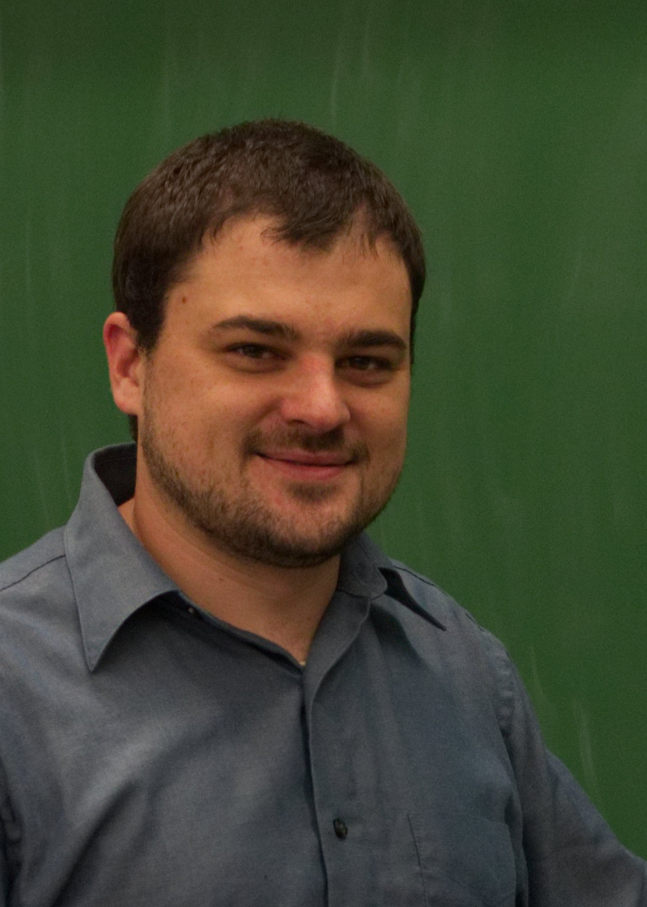

---
title: About Me
...

# About Me

I am an Assistant Professor of Computer Science at the University of Virginia. I am a receipient of the [UVA All-University Faculty Teaching Award](https://news.virginia.edu/content/courses-cooking-online-uvas-award-winning-teachers-connect-students) in 2021, a recipient of the Professor of the Year award of the [UVA ACM Student Chapter](http://acm.cs.virginia.edu/) in 2018 and 2022, a recepient of the [UVA Distinguished Graduate Teaching Award in STEM](https://gradstudies.virginia.edu/teachingawards) in 2017, and a finalist for the Trigon Thomas E. Hutchinson Award in 2019 and 2021 (awarded for impact on the engineering student body, selected by student vote). I am currently the Department of Computer Science Undergraduate Research Coorindator, Co-Coach for the UVA International Collegiate Programming Contest (ICPC) team, member of the UVA Engineering Core Curriculum Task Force, and member of the UVA Computer Science Undergraduate Student Experience Committee. I have previously served as chair of the CS Department Discrete Math and Theory Curriculum Committee.
I have a BA in Math and Computer Science, an Masters of Computer Science (MCS), and a PhD in Computer Science, all from the University of Virginia. Yes, this makes me a rare "Quadruple Hoo", and I invite you to come talk to me about my perspectives on that sometime!

While I still engage in research relating to applications of automata theory for special-purpose computing archictectures, my primary research activities focus on computing education. In particular, I am interested in investigating tools-free ways of addressing academic integrity in computing courses, and in pedagogical practices and course designs for teaching math and computing theory topics.

You can find my CV [here](/files/brunelle_cv.pdf).

